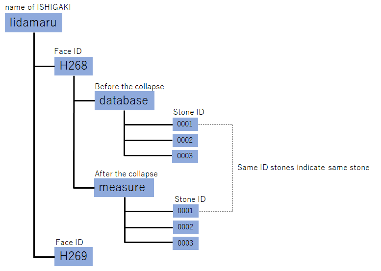

<H1>OpenISHIGAKI Dataset</H1>

# IIDAMARU dataset

・<a href="http://navi.cs.kumamoto-u.ac.jp/~koutaki/ISHIGAKI/H268.zip">H268: 250 stones (H268.zip 1.2GByte)</a> 

・<a href="http://navi.cs.kumamoto-u.ac.jp/~koutaki/ISHIGAKI/H269.zip">H269: 120 stones (H269.zip 458MByte)</a> 

# File structure
The data is hierarchically organized as follows.

　ISHIGAKI->Face ID->database or measure -> stone_ID 

One folder contains the data for one stone.
The same Stone ID with the same Face ID means the same stone.
This is the result of mapping by the stonemason.

## Files before the collapse of each stone
Includes image data and 2D contour data (unit: mm) before the collapse. Position data before the collapse is also available.

## Files after the collapse of each stone
Includes stereo image pair, reconstructed 3D obj model, and 3D contour data (unit: mm) after the collapse. GPS Position data after the collapse is also available.

# All files
http://navi.cs.kumamoto-u.ac.jp/~koutaki/ISHIGAKI/

