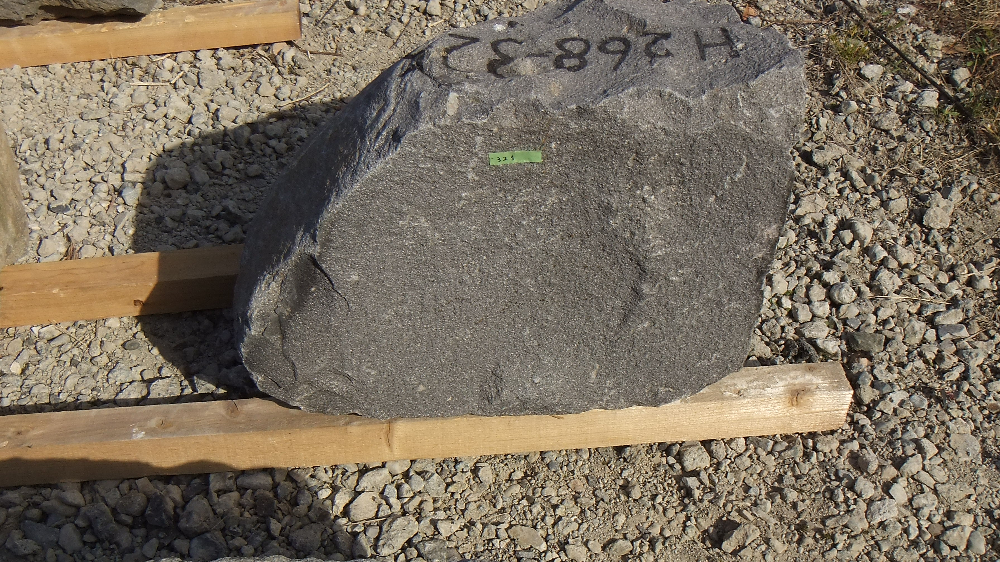

<H1>OID: Open ISHIGAKI Dataset</H1>

# File structure

# IIDAMARU

## H268: 250 stones
<a href="http://navi.cs.kumamoto-u.ac.jp/~koutaki/ISHIGAKI/H268.zip">H268.zip (1.2GByte)</a> 

## H269: 120 stones
<a href="http://navi.cs.kumamoto-u.ac.jp/~koutaki/ISHIGAKI/H269.zip">H269.zip (458MByte)</a> 

# All files
http://navi.cs.kumamoto-u.ac.jp/~koutaki/ISHIGAKI/

